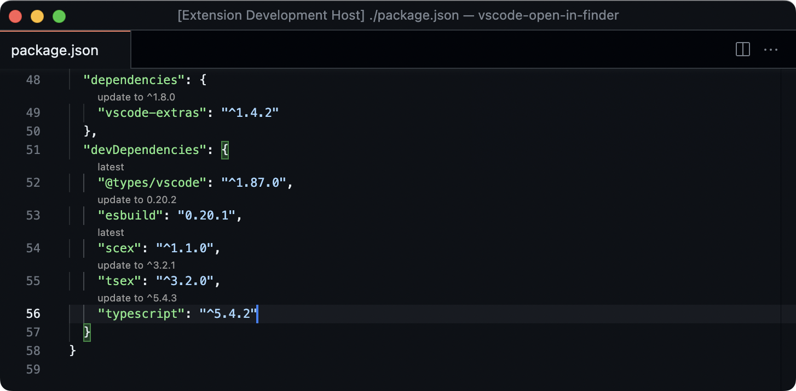

# Outdated

<p align="center">
  
</p>

A super quick way to update npm dependencies, via a code lens.

This extension requires `npm-cli` to be installed and it only works for npm dependencies listead in `package.json` files.

## Install

Follow the instructions in the [Marketplace](https://marketplace.visualstudio.com/items?itemName=fabiospampinato.vscode-outdated), or run the following in the command palette:

```sh
ext install fabiospampinato.vscode-outdated
```

## Usage

It adds 3 commands to the command palette:

```js
'Outdated: Disable' // Disable the code lense
'Outdated: Enable' // Enable the code lense
'Outdated: Refresh' // Force refresh the code lense
```

## Settings

```js
{
  "outdated.enabled": true // Whether the code lense is enabled or not
}
```

## Demo



## License

MIT © Fabio Spampinato
